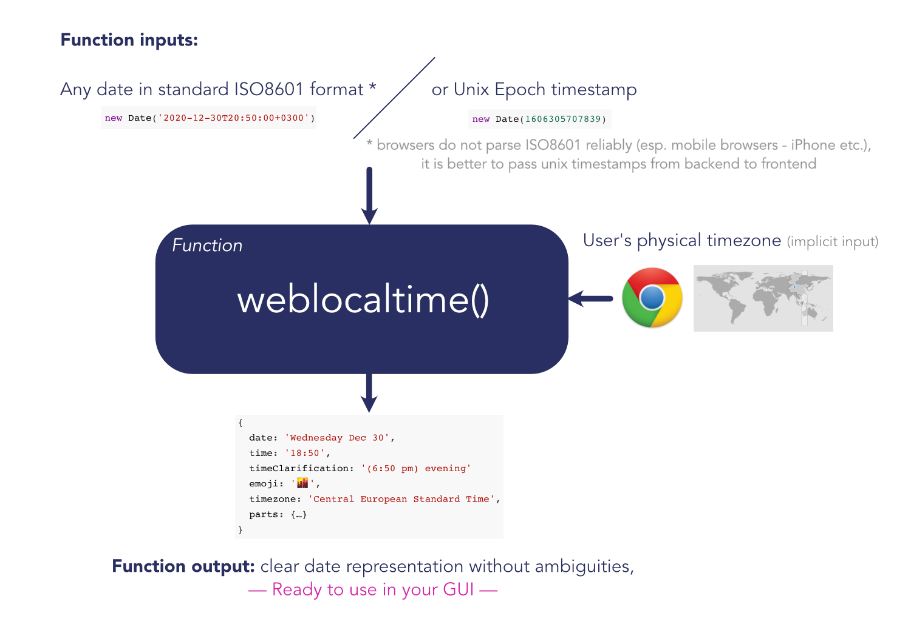

# weblocaltime
> Reliably convert time to local timezone in user browser.


Recently everyone is organizing a lot of online events or conferences and many of them show dates in ways that are very easy to misinterpret. **This library / approach solves the problem in a minimal and clear way.**

This document became more extensive than planned but let not that confuse you, you only have to read 10% of it to understand exactly **how and why** to use this library. The rest are details if you happen to be a more curious type 🐰.

If you are **really curious** join our weekly meetups where you can learn more great **Digital Mastery Techniques**. Sometimes in _boring detail_ that can be readily forgotten and abstracted away as soon as you wish.

We are developing a [search engine](https://zetaseek.com) that can bring out these details later as needed _if needed_. 

Computers are great for **a)** speed **b)** storing boring details. **Let's get back to our subject at ✋hand now.**

## How weblocaltime works

**weblocaltime** is a **function** that solves the issue of clear local date/time representation in two steps:

**1)** correctly applies the modern browser [Intl Date Format API](https://developer.mozilla.org/en-US/docs/Web/JavaScript/Reference/Global_Objects/Intl/DateTimeFormat/DateTimeFormat) to convert dates to web browser local timezone

**2)** properly formats the resulting time and adds additional clarification to date/time presentation to prevent all possibilities for misunderstanding



<hr>

Library works in environments besides web browser that also support the **Intl API**, for example [Node.js](https://nodejs.org/) and [Deno](https://deno.land/).

Library exports only one function:

```js
export default weblocaltime;
```

Import it (`node.js`):

```
npm install weblocaltime
```

```js
import weblocaltime from 'weblocaltime';
```

Or directly in your frontend using [jspm](https://jspm.org/) without even needing to bundle or serve it yourself:

```html
<!DOCTYPE html>
<html>
<head>
  <meta charset="utf-8" />
  <script type="module">
    // Statically:
    import weblocaltime from 'https://jspm.dev/weblocaltime';
    console.log("Static import from jspm:");
    console.log(weblocaltime(new Date('2020-12-31T23:00:00+0000')));

    // Dynamically:
    (async () => {
      const { default: weblocaltime } = await import('//jspm.dev/weblocaltime');
      console.log("Dynamic import from jspm ...");
      const { date, time, timeClarification, emoji, timezone } = weblocaltime(new Date('2020-12-31T23:00:00+0000'));
      document.querySelector('span').innerText = `${emoji} ${date} at ${time} ${timeClarification} — ${timezone}`;
    })();
  </script>
</head>

<body>
  Date: <span></span> <!-- 🌚 Friday Jan 1 2021 at 0:00 (12:00 am) midnight — Central European Standard Time -->
</body>

</html>
```

Read more about the new [ES6 modules usage in browser](https://developer.mozilla.org/en-US/docs/Web/JavaScript/Guide/Modules).

You can create your own frontend bundle using [rollup.js](https://rollupjs.org/) or a similar bundler tool.

## Function API

Function expects two arguments.

```js
function weblocaltime(date, { utc = false, showYear = true } = {}) { … }
```

1) **required** → standard _JavaScript_ `Date` object

2) _optional_ → `utc: bool`, `showYear: bool` which are explained later in this document

## Demo of actual use case

You can see the demo of the library in action at [dmt-system](https://dmt-system.com).

Check out the demo and you are also invited to join one of our meetings. 

> Welcome to provide ideas or just listen — anonymously or not.

<hr>

Some background about our project **(optional reading)** →

[**dmt-system**](https://dmt-system.com) is about _easy to use performant fully-contained networked local-first apps_ that integrate well with other modern platforms and technologies and are under end users' total control.

- _easy to use:_ fast and reliable
- _fully-contained:_ each computer or server has 1) full server ('backend') logic and 2) full GUI ('frontend') code
- _networked:_ app instances talk to each other over fast websocket ([connectome](https://github.com/uniqpath/connectome)) connections
- [_local-first_](https://www.inkandswitch.com/local-first.html): GUI is usually served from local instance on particular machine. Data is also local to the instance as much as possible.

**weblocaltime** was implemented to solve the practical problem of online meetup coordination for our R&D purposes and since it worked well, we are sharing the code / approach.

Actual example GUI implementation in [Svelte](https://svelte.dev/) framework for _dmt-system website_ is here:

**JavaScript logic part**:

```js
import weblocaltime from 'weblocaltime';

// … get 'startsAtUnixTimestamp' over the wire with the help of connectome library

$: _startsAt = startsAtUnixTimestamp ? new Date(startsAtUnixTimestamp) : undefined;

let displayUTC = false;

$: startsAt = _startsAt ? weblocaltime(_startsAt, { showYear: false, utc: displayUTC }) : {};

function toggleUTC() {
  displayUTC = !displayUTC;
}
```

**HTML template part (view):**

```html
<div class="starts_at">              
  <span class="event_time">
    {startsAt.emoji} {startsAt.date} 
    <span class='deemph'>at</span> 
    {startsAt.time} <span class='deemph'>{startsAt.timeClarification}</span>
  </span>              
</div>

<div class="timezone">
  {startsAt.timezone} | 
  <a href="#" on:click|preventDefault={() => toggleUTC()}>{displayUTC ? 'My timezone' : 'UTC'}</a>
</div>
```

You can use the `weblocaltime` function in a similar way from other [frontend frameworks](https://developer.mozilla.org/en-US/docs/Learn/Tools_and_testing/Client-side_JavaScript_frameworks) like React, Ember or Vue.

## Job Ad(s)

If you are good with **Svelte** and **HTML / CSS** please write to info@uniqpath.com, we would like you to create an extensible Svelte component based on this so we can make this a dependency of our website and to make this useful in other parts of the system, like our ZetaSeek search engine.

You can also create an issue in this GitHub repository or talk to us through [Discord](https://discord.gg/XvJzmtF).

This task is paid fairly but must be executed in at most 1-2 weeks from the start and with high quality. 

Thank you very much.

<hr>

There is more opportunities besides the creation of **Local Time Event Svelte component**. 

If you think you can improve this library in any way, please reach  out, now is the right time to define and consolidate api, do some more testing and release the `v1.0` of this simple utility.

## Definition of the problem

**This should possible be the proper way to start the document but we still decided to go with more practical examples of the solution first since everyone can identify with the problem even without formal specification.**

<hr>

There are many hidden issues and edge cases when trying to make clear exactly what time an event is happening.

Which timezone do we use? Preferably the end user's timezone. In modern browsers we can do that well now ✓

But this is only the beginning, even with this **there are many opporunities for misunderstanding**.

Examples:

`Friday Nov 27 at 9:00`

This supposes we used 24h time format (0h-23h) because we don't see explicit am/pm tags. We cannot be really sure though because perhaps am/pm denotation was omitted by mistake → So is this event at `9 am` or `9 pm`? If we usually don't even use the 24h format in our country and are not familiar with it, then we actually assume that am/pm tags are missing and we are confused.

What if we used 12h format and always displayed `am` / `pm` attached to time?

`Friday Nov 27 at 9:00 am`

This seems fine but there are two problems:

- some users prefer the 24h format and it is additional mental overhead to convert `8 pm` into `20h` etc.
- there are edge cases at `noon`

Edge case is:

`Friday Nov 27 at 12:05 pm`

Most users not readily familiar with 12h format are instantly confused by this. Is this 5 minutes after midnight or noon? The default `Intl` browser implementation even reports this is as `0:05 pm` which is extremely confusing. This does mean `noon` (midnight is `0:00 am`) but we shouldn't be expected to know that if we are not native users of 12h time format.

## Solution specification

- For times just after midnight (= 0:xx / 12:xx am) we will show time in both formats with additional `midnight` tag. Example: `0:50 (12:50 am) midnight`
- For times before `noon` (< 12:00) (excluding midnight) we will show time in 12h format - attaching `am` to time. This is always clear. Example: `10:00 am`
- For `noon` (= 12:xx) we will show this: `12:15 (noon)`. If we also show emoji, this is represented with ☀️.
- For times after `noon` (>= 13:00) we will show the time in **both formats** (24h and 12h). Example: `19:50 (7:50 pm)`
- In addition we always clarify what time of day it is (`morning`, `daytime`, `noon`, ` evening` or `night` / `midnight`). Example: `19:50 (7:50 pm) evening`
- Furthermore we can show an **emoji** as well.
- We also allow users to always see the date/time in `UTC` timezone besides their local timezone.

This should do the trick. [Solution](https://github.com/dmtsys/weblocaltime/blob/main/src/index.js) is around 70 LOC _(lines-of-code)_.

## API

```js
import weblocaltime from 'weblocaltime';

const datetime = new Date('2020-12-30T20:50:00+0200');

const { date, time, timeClarification, emoji, timezone, parts } = weblocaltime(datetime);

// =>

{
  date: 'Wednesday Dec 30 2020',
  time: '19:50',
  timeClarification: '(7:50 pm) evening',
  emoji: '🌆',
  timezone: 'Central European Standard Time',
  parts: {
    day: '30',
    month: 'December',
    monthShort: 'Dec',
    monthNumeric: '12',
    year: '2020',
    hour24: '19',
    minute: '50',
    second: '00',
    weekday: 'Wednesday',
    weekdayShort: 'Wed',
    time24: '19:50',
    time12: '7:50 pm',
    timezone: 'Central European Standard Time'
  }
}
```

Notice that the [ISO8601 date](https://en.wikipedia.org/wiki/ISO_8601) (`'2020-12-30T20:50:00+0200'`) we pass in can be specified in any timezone (`+0200` in this example). It will get converted from any timezone to our local timezone (`Central European Standard Time` in this test case in that particular user browser).

`timeClarification` is separate so we can style it a bit deemphasized (see the demo example ↑).

<hr>

**To see the representation for the `UTC` time zone do this:**

```js
import weblocaltime from 'weblocaltime';

const datetime = new Date('2020-12-05T14:20:00+0500');

const { date, time, timeClarification, emoji, timezone, parts } = weblocaltime(datetime, { utc: true });

// =>

{
  date: 'Saturday Dec 5 2020',
  time: '9:20 am',
  timeClarification: 'morning',
  emoji: '🌅',
  timezone: 'Coordinated Universal Time (UTC)',
  parts: {
    day: '5',
    month: 'December',
    monthShort: 'Dec',
    monthNumeric: '12',
    year: '2020',
    hour24: '09',
    minute: '20',
    second: '00',
    weekday: 'Saturday',
    weekdayShort: 'Sat',
    time24: '09:20',
    time12: '9:20 am',
    timezone: 'Coordinated Universal Time (UTC)'
  }
}
````

ISO8601 date we passed in was specified in `+0500` timezone offset this time.

We asked for the representation in `UTC` instead of browser local timezone in this example.

This representation can be used to show your users the time in `UTC` (on request) in addition to their local timezone so that there is absolutely no confusion.

<hr>

**To omit the year because the event is in current year:**

```js
const { date, time, timeClarification, emoji, timezone, parts } = weblocaltime(datetime, { showYear: false });

// =>

{
  date: 'Saturday Dec 5',
  time: '9:20 am',
  …
}
```

### More examples

```
git clone https://github.com/dmtsys/weblocaltime.git

cd weblocaltime

node examples/index.js
```

Please use nodejs version `v14.0.0+`.

### Use in your frontend code

```js
import weblocaltime from 'weblocaltime';

...
```

Library is ready to be bundled for browser and node.js, it should work with `rollup` and other module bundlers.

## Building bundle manually

If you cloned the repo instead of installing the npm module, you can create bundles yourself.

Running `npm run build` will produce `./dist/index.js` (CommonJS) and `./dist/index.mjs` (modern ES6).

Published npm package consists of exactly these two files.

## Warnings

⚠️ Browsers do not parse ISO8601 date format reliably, always pass datetime into your frontend as [unix timestamp](https://en.wikipedia.org/wiki/Unix_time) _(milliseconds since  00:00:00 UTC) on 1 January 1970 - an arbitrary date; leap seconds are ignored)_.

```js
> Date.now()
1606233730482
> new Date(1606233730482)
"2020-11-24T16:02:10.482Z"
```

Parse unix timestamp on the frontend by passing the timestamp into `Date` constructor and then use this object with `weblocaltime` function. This is the most reliable way with no edge cases.

```js
> new Date('2020-12-31T23:00:00+0000').getTime()
1609455600000
```

👆This is how you get the unix timestamp from plain JS Date object.

Use this [great utility](https://www.epochconverter.com/) as a handy helper when you need to make sure you are working with correct dates and to prevent bugs.
